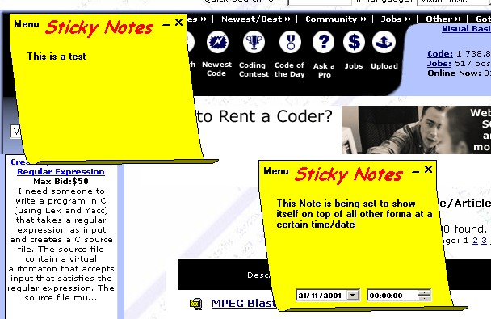



## Sticky Notes

### Description

This program, which loads in to the system tray, allows you to put 'post-it notes' on your desktop to remind you about stuff you have got to do. Features a date/time function for a Sticky Note to pop up and remind you what you wrote in it. Can be minimised and hidden, or minimised to the task bar depending on what you select. I use this program because I can never find enough space for more post-it notes as my screen becomes surrounded by yellow paper! :o)
 
### More Info
 

             |
---                |---
**Submitted On**   |2001-11-21 17:05:26
**By**             |[Wamdue Project](https://github.com/Planet-Source-Code/PSCIndex/blob/master/ByAuthor/wamdue-project.md)
**Level**          |Intermediate
**User Rating**    |4.7 (42 globes from 9 users)
**Compatibility**  |VB 6\.0
**Category**       |[Complete Applications](https://github.com/Planet-Source-Code/PSCIndex/blob/master/ByCategory/complete-applications__1-27.md)
**World**          |[Visual Basic](https://github.com/Planet-Source-Code/PSCIndex/blob/master/ByWorld/visual-basic.md)
**Archive File**   |[Sticky\_Not3650111212001\.zip](https://github.com/Planet-Source-Code/wamdue-project-sticky-notes__1-29068/archive/master.zip)

